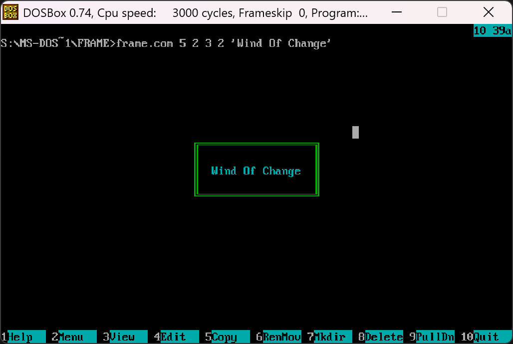
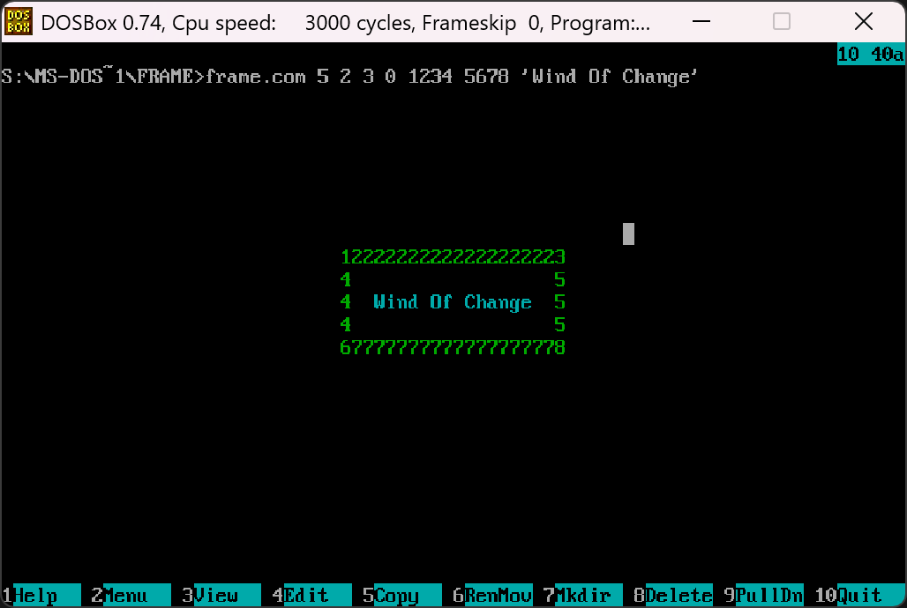
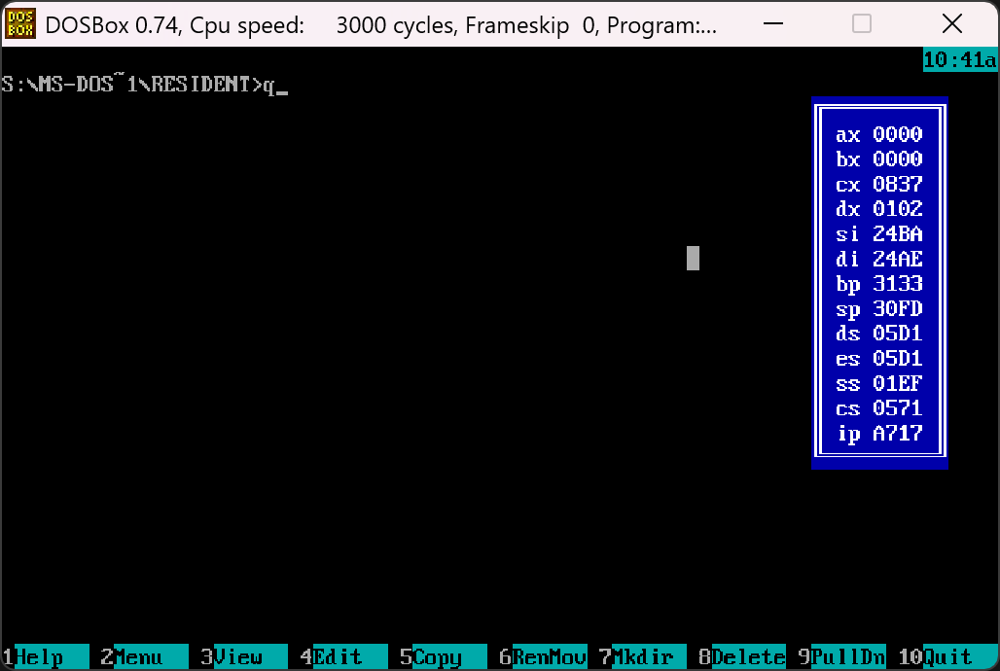

# MS-DOS-ASM

MS-DOS программы (режим реальных адресов):

## 1. Frame 
Печать рамки с пользовательскими параметрами.

<pre>
arg_1 - высота рамки (min 3)
arg_2 - цвет рамки
arg_3 - цвет текста
arg_4 - стиль рамки (доступно 6 базовых стилей)
        если arg_4 = 0, то ожидается 9 символов пользовательского стиля
arg_5 - выводимый текст в одинарных кавычках

</pre>

Пример: 

  
  

## 2. Resident
Резидентная программа показывающая текущее состояние регистров.

<pre>
Q - начать отрисовку регистров
W - остановить отрисовку
</pre>

Пример:

## 3. CreakMe
Имеется два уровня сложности. Осторожно далее спойлер.

    
Краткое описание уязвимостей

    1. Easy. Буфер находится в середине кода, тем самым с помощью переполнения буфера можно изменить поведение программы.

    2. Hard. Необходимо переполнить буфер таким образом чтобы дотянутся до стека. Пароль размером 64кб))

